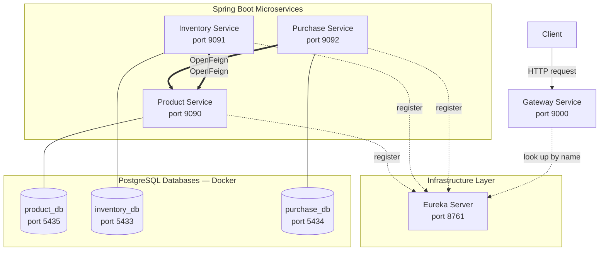

Sistema de Gestión de Inventario follows a distributed microservices architecture where each domain — products, inventory, and purchases — runs as an independent Spring Boot application with its own PostgreSQL database. All external traffic enters through a single Spring Cloud Gateway, which resolves upstream addresses dynamically via a Netflix Eureka service registry, eliminating hardcoded IPs between services. Inter-service calls are made declaratively using OpenFeign clients, keeping communication concerns out of business logic.

## Architecture overview

The system is organized into three logical layers: a routing layer (Gateway), a discovery layer (Eureka), and a cluster of business microservices each backed by an isolated database.



<Info>
  The Gateway resolves service addresses by logical name (e.g., `product-service`), not by IP or port. Eureka handles the lookup at request time, so you can scale or restart individual services without reconfiguring the Gateway.
</Info>

## Service components

<CardGroup cols={2}>
  <Card title="Gateway Service" icon="door-open">
    **Port:** `9000`  
    **Role:** Single entry point for all external requests. Routes traffic to upstream services by name using Eureka discovery. Configured with `lb://` (load-balanced) URIs so routing survives restarts and scaling.
  </Card>
  <Card title="Eureka Server" icon="tower-broadcast">
    **Port:** `8761`  
    **Role:** Service registry. All microservices register on startup and send periodic heartbeats. The Gateway and Feign clients resolve service locations through Eureka rather than hardcoded hosts.
  </Card>
  <Card title="Product Service" icon="box">
    **Port:** `9090` | **Database:** `product_db` (PostgreSQL port `5435`)  
    **Role:** Manages the product catalog, categories, and suppliers. Exposes product and supplier lookup endpoints consumed by other services via OpenFeign.
  </Card>
  <Card title="Inventory Service" icon="warehouse">
    **Port:** `9091` | **Database:** `inventory_db` (PostgreSQL port `5433`)  
    **Role:** Tracks real-time stock levels, goods receipts, and stock movements. Calls Product Service to resolve product names when building inventory records.
  </Card>
  <Card title="Purchase Service" icon="cart-shopping">
    **Port:** `9092` | **Database:** `purchase_db` (PostgreSQL port `5434`)  
    **Role:** Orchestrates purchase orders. Calls Product Service to validate products and resolve supplier names, making it the primary consumer of inter-service communication.
  </Card>
</CardGroup>

### Service port reference

| Service | App port | Database | DB port |
|---|---|---|---|
| Gateway Service | `9000` | — | — |
| Eureka Server | `8761` | — | — |
| Product Service | `9090` | `product_db` | `5435` |
| Inventory Service | `9091` | `inventory_db` | `5433` |
| Purchase Service | `9092` | `purchase_db` | `5434` |

## Database-per-service pattern

Each microservice owns an isolated PostgreSQL schema with no shared tables. This means:

- **Schema changes** in one service have no impact on others.
- **Services scale independently** — you can add replicas of Purchase Service without affecting Product or Inventory.
- **Failures are contained** — a database outage in `purchase_db` does not bring down product or inventory reads.

<Warning>
  Because each service owns its data, there are no database-level foreign keys across service boundaries. Referential integrity between services (e.g., a purchase referencing a valid product) is enforced at the application layer through OpenFeign calls at write time.
</Warning>

All three databases run as separate PostgreSQL 16 containers managed by Docker Compose, with init scripts that seed categories, suppliers, products, and sample transaction records on first startup.

## Service discovery with Eureka

On startup, each microservice registers itself with Eureka at `http://localhost:8761/eureka/` using its logical `spring.application.name` (e.g., `product-service`, `inventory-service`, `purchase-service`). Eureka stores the instance's IP address and port, and services send periodic heartbeats to confirm availability.

<Steps>
  <Step title="Service registers with Eureka">
    When a microservice starts, it posts its metadata (name, host, port) to the Eureka registry. The registry entry is kept alive via heartbeats every 30 seconds by default.
  </Step>
  <Step title="Gateway resolves routes by name">
    The Gateway is configured with routes like `uri: lb://product-service`. At request time, it asks Eureka for the current IP and port of `product-service` and forwards traffic accordingly.
  </Step>
  <Step title="Feign clients resolve by name">
    OpenFeign clients in Purchase Service and Inventory Service declare `@FeignClient(name = "product-service")`. Spring Cloud resolves this to a live instance address through Eureka before making the HTTP call.
  </Step>
</Steps>

<Note>
  Eureka is configured with `register-with-eureka=false` and `fetch-registry=false` on the server itself — it does not register as its own client. All three microservices register as clients with `prefer-ip-address=true` so Eureka records IP addresses rather than hostnames, which is more reliable in containerized environments.
</Note>

## Inter-service communication with OpenFeign

OpenFeign generates HTTP client implementations from annotated Java interfaces, so services call each other using plain method calls rather than manually constructed `RestTemplate` or `WebClient` requests.

### Purchase Service → Product Service

Purchase Service declares two separate Feign clients against `product-service`:

```java
// Resolve a product's name during purchase order creation
@FeignClient(name = "product-service", contextId = "productClient")
public interface ProductClient {
    @GetMapping("/product/{productId}/name")
    ProductDTO getProductName(@PathVariable("productId") Long productId);
}

// Resolve a supplier's company name during purchase order creation
@FeignClient(name = "product-service", contextId = "supplierClient")
public interface SupplierClient {
    @GetMapping("/supplier/{supplierId}/name")
    SupplierDTO getSupplierCompanyName(@PathVariable("supplierId") Long supplierId);
}
```

### Inventory Service → Product Service

Inventory Service uses a single Feign client to enrich inventory records with product names:

```java
@FeignClient(name = "product-service")
public interface ProductClient {
    @GetMapping("/product/{productId}/name")
    ProductDTO getProductName(@PathVariable("productId") Long productId);
}
```

<Tip>
  Both clients use a 5-second connect timeout and 5-second read timeout (`feign.client.config.default.connect-timeout=5000`). Adjust these values in each service's `application.properties` if you experience latency in your environment.
</Tip>

## Tech stack

| Layer | Technology |
|---|---|
| Language | Java 25 |
| Framework | Spring Boot 3.5.13 |
| Cloud libraries | Spring Cloud 2024.0.0 |
| Service registry | Netflix Eureka (Spring Cloud Netflix) |
| API gateway | Spring Cloud Gateway |
| Inter-service calls | OpenFeign (Spring Cloud OpenFeign) |
| Persistence | Spring Data JPA / Hibernate |
| Database | PostgreSQL 16 |
| Containerization | Docker / Docker Compose |
| Build tool | Apache Maven |

<Info>
  The root `pom.xml` is a multi-module Maven project that declares `gateway-service`, `product-service`, `inventory-service`, `purchase-service`, and `eureka-server` as child modules under the `io.github.leandro12rk` group. Running `mvn install` from the root builds all modules in dependency order.
</Info>
